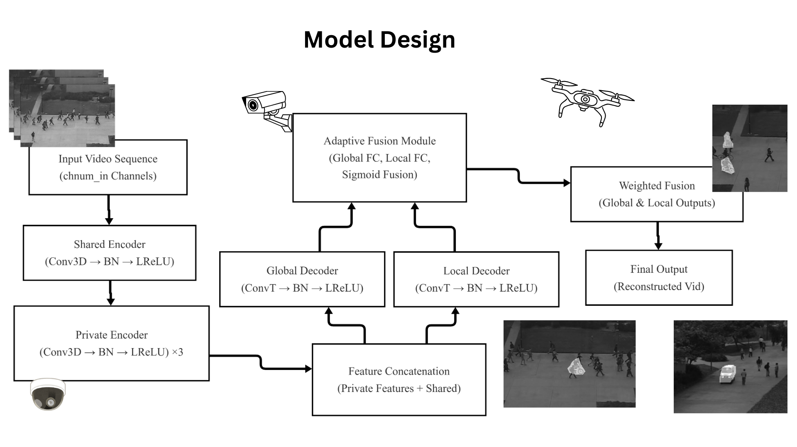
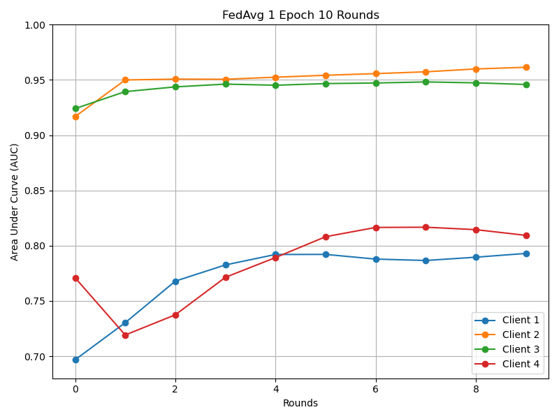
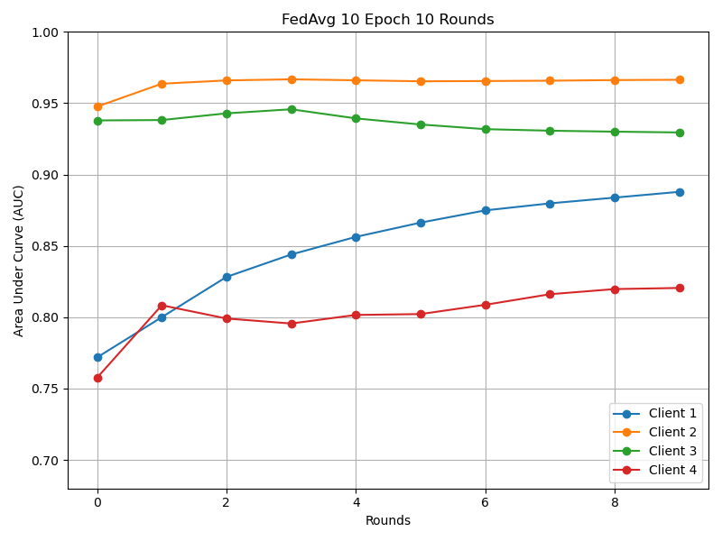
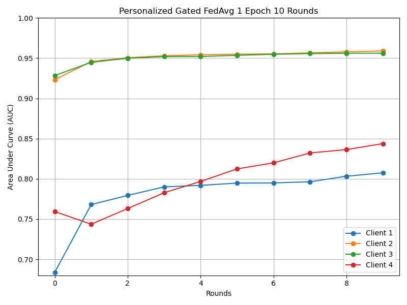
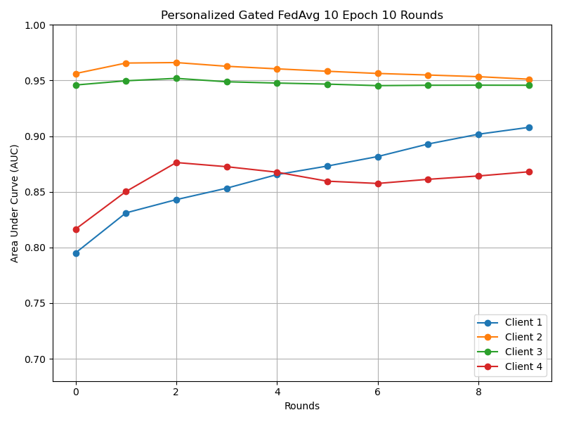
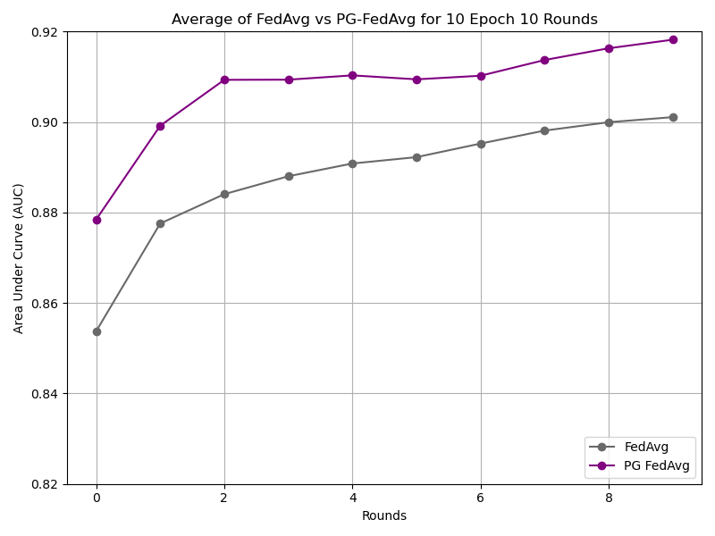

# PG-FAD - Personalized Gates for Federated Anomaly Detection
The project explores the application of federated learning techniques with a personalized approach, leveraging gating mechanisms to enhance anomaly detection across distributed systems.

<p><strong>Author:</strong> Westin Perry<br /><strong>College:</strong> Rochester Institute of Technology<br /><strong>Email:</strong> wcp9372@g.rit.edu</p>
<div align="center">
  
  <p><i>Figure: Overview of the PG-FAD framework, demonstrating personalized federated anomaly detection with gated modules.</i></p>
</div>

## 📋 Table of Contents
- [🚀 PG-FAD](#pg-fad)
  - [📚 Table of Contents](#-table-of-contents)
  - [🔧 Installation](#installation)
    - [📥 Clone the repository](#clone-the-repository)
    - [🛠️ Create and activate conda environment](#create-and-activate-conda-environment)
    - [📦 Install additional dependencies](#install-additional-dependencies)
  - [🗂️ Project Structure](#project-structure)
  - [⚙️ Usage](#usage)
    - [🏋️‍♂️ Training](#training)
    - [📊 Evaluation](#evaluation)
  - [🎥 Demo](#demo)
  - [📈 Results & Visualization](#results--visualization)
  - [📝 Model Card](#model-card)
  - [🔖 Citation](#citation)
  - [💡 Acknowledgments](#acknowledgments)
  - [📜 License](#license)

## Installation

### Clone the repository
```bash
git clone https://github.com/westinperry/PG-FAD.git
cd PG-FAD
```
### Create and activate conda environment
```bash
conda env create -f environment.yml
```
```bash
conda activate PG-FAD
```

### Other Information
- The UCSD_Ped2 and UCSD_Ped1 datasets are already included and properly setup in datasets folder. <br> <br>
- Only UCSD_Ped2 was used for testing. <br> <br>
- Dataset is avaliable from <href>http://www.svcl.ucsd.edu/projects/anomaly/dataset.htm <br> <br>
- process_data.py can be used to pre-process original dataset into required files, then split data into clients, and follow stucture below. Not need, dataset is included in files.<br> <br>
- For Best (and Tested) Performance/Results ensure using a CUDA equiped device. <br> <br>
- Project is setup for 4 clients. Using less clients is possible, but alteration of this code is required. <br> <br>
- Results/Results.xlsx contains data for all graphs produced in figures

## Project Structure

```
PG-FAD/
    ├── data/           # Scripts for managing Video Datasets
    ├── datasets/       # Dataset storage
    │   ├── processed_1   # Individual Client 1 Data
    |   |    ├── UCSD_ped1
    |   |    └── UCSD_ped2
    │   ├── processed_2    # Individual Client 2 Data
    |   |    ├── UCSD_ped1
    |   |    └── UCSD_ped2
    │   └── ...
    ├── figures/        # Images for GitHub Page
    ├── models/         # Trained model checkpoints
    │   ├── client_1      # Individual Client Model
    │   ├── client_2
    │   └── ..
    ├── options/        # Script for Training/Testing Options
    ├── results/        # Testing Results
    ├── scripts/        # Scripts Training/Testing/FedAvg
    ├── utils/          # Utility Scripts
    ├── _config.yml     # GitHub Theme
    ├── commands.txt    # Useful commands
    ├── environment.yml # Conda Environment
    ├── LICENSE         # License
    └── README.md       # Project documentation
```

## Usage
⚠️ Replace --ModelName with the model you want to use in ./scripts/run.sh <br>
--ModelName AE  -  Baseline model <br>
--ModelName Gated_AE  -  to use the gated model. <br>
To run the entire training pipeline (including federated averaging and testing), execute:
```bash
cd scripts
./run.sh
```
This script will:
<ul>
<li>Train each client (from scratch or resume from checkpoints) 🏋️‍♂️</li>
<li>Perform federated averaging 🔄</li>
<li>Run the testing phase 📊</li>
<li>Save all outputs (checkpoints, logs, and results) in the appropriate folders 📁</li>
<li>⚠️ Note: Adjust the Epoch # (for each client) and Round # (number of times clients are trained, then FedAvged—with or without gates) in run.sh as needed</li>
</ul>

### Training
#### Direct Python Training command:
```bash
python script_training.py --DataRoot ../data --ModelRoot ../models --OutputFile final_model.pt --ModelName AE
```
(Replace --ModelName AE with --ModelName Gated_AE to use the gated model. AE was used as baseline.)
Example:
```bash
python script_training.py \
    --ModelRoot "../models/client_1" \
    --OutputFile "client1_local1.pt" \
    --DataRoot "../datasets/processed_1" \
    --Dataset "UCSD_P2_256" \
    --EpochNum 1 \
    --BatchSize 6 \
    --TextLogInterval 10 \
    --IsTbLog False \
    --ModelName "AE" \
    --UseCUDA True \
    --Seed 42 \
    --IsDeter True \
    --LR 0.001
```

#### Direct Python FedAvg Command:
```bash
python script_fedavg.py \
    --input-paths ../models/client_1/client1_local1.pt ../models/client_2/client2_local1.pt ../models/client_3/client3_local1.pt ../models/client_4/client4_local1.pt \
    --output-paths ../models/client_1/client1_combined1.pt ../models/client_2/client2_combined1.pt ../models/client_3/client3_combined1.pt ../models/client_4/client4_combined1.pt \
    --ModelName "AE"
```
⚠️ Will fail if using incorrect model names!

### Evaluation
#### Direct Python Evaluation Command:

Run the evaluation script to compute ROC curves and AUC scores:

```bash
python script_testing.py --DataRoot ../data --Dataset UCSD_P2_256 --ModelFilePath ../models/final_model.pt --ModelName AE
```
The evaluation outputs (plots, results.txt, etc.) are saved to the results/ folder (located one directory above the scripts folder).

Example:
```bash
python script_testing.py \
    --ModelFilePath "../models/client_1/client1_combined1.pt" \
    --DataRoot "../datasets/processed_1" \
    --Dataset "UCSD_P2_256" \
    --ModelName "AE"
```

The evaluation script will compute the ROC curve, AUC score, and save the corresponding plots and logs under the results/ directory. 
⚠️ Note: The ROC curve will only be saved for the latest model evaluated (others will be overwritten)

## Demo

You can run a demo by adjusting the EPOCH and ROUNDS to 1 in the ./scripts/run.sh file.
This will make each client to train for 1 epoch, average all clients, then evalue each client.
Results will be in the results/results.txt file. You can also re-run using either MODEL_NAME "AE" for baseline or "Gated_AE" for Personalized Gated Federated Learning

```bash
./run.sh
```

## Results & Visualization
#### (See Figure Folder for 5 Epoch Results)
Results of Normal FedAvg across 1/10 Epochs (Left to Right) for 10 Rounds of Averaging
<p align="center">
  
  
</p>
Results of Normal FedAvg across 1/10 Epochs (Left to Right) for 10 Rounds of Averaging
<p align="center">
  
  
</p>
Results of Personalized Gate FedAvg across 1/10 Epochs (Left to Right) for 10 Rounds of Averaging
<p align="center">
  
  
</p>
Averages of PG-FedAvg and Normal FedAvg across 1/10 Epochs (Left to Right) for 10 Rounds of Averaging

## Remove Environment

```bach
conda deactivate
conda env remove --name PG-FAD
```

## Citation

If you use this code in your research, please cite:

```bibtex
@article{
  westin,
  title="PG-FAD: Personalized Federated Anomaly Detection with Gated Modules",
  author="Westin Perry",
  institution="Rochester Institute of Technology",
  year="2025"
}
```
## Acknowledgments

This project extends the work presented in [Memorizing Normality to Detect Anomaly: Memory-augmented Deep Autoencoder for Unsupervised Anomaly Detection](https://github.com/donggong1/memae-anomaly-detection) by Dong Gong et al. Their innovative approach has provided a solid foundation and inspiration for the techniques implemented in PG-FAD. We are grateful for their contribution to the field.

Below is the citation for their work:

```bibtex
@inproceedings{gong2019memorizing,
  title={Memorizing Normality to Detect Anomaly: Memory-augmented Deep Autoencoder for Unsupervised Anomaly Detection},
  author={Gong, Dong and Liu, Lingqiao and Le, Vuong and Saha, Budhaditya and Mansour, Moussa Reda and Venkatesh, Svetha and Hengel, Anton van den},
  booktitle={IEEE International Conference on Computer Vision (ICCV)},
  year={2019}
}
```

## License

This project is licensed under the MIT License - see the [LICENSE](LICENSE) file for details.
